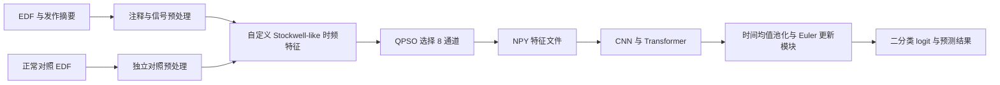

# 基于Transformer的癫痫预测系统

**2025 年生物医学工程创新设计大赛 · 国家三等奖**

本仓库整理并公开参赛项目保留下来的 EEG 算法研究代码，包括信号预处理、时频特征、通道选择、CNN / Transformer 模型以及预测结果分析。项目名称和获奖信息由项目持有人提供。

**归档状态：原始测试数据已遗失。** 本仓库提供代码与运行说明，不包含原始 EEG、测试划分、训练好的权重或可复核的竞赛性能指标。旧笔记本输出已清理；历史输出不作为本次验证结果。

当前训练入口按照 `patients/` 与 `controls/` 目录赋予二分类标签。它实现的是**患者/正常对照分类研究原型**；发作前、发作中等预处理标签没有进入当前模型监督目标。完整的发作提前预测任务仍需重新定义标签、预测时域和独立评估方案。详见 [已知限制](docs/KNOWN_LIMITATIONS.md)。

## 算法流程



患者流程包含 EDF/FIF 转换、发作注释、SSP 投影器移除、滤波、重采样、Kalman 基线处理、ICA、分段和特征选择。历史流程存在不同的参数和处理策略，保留各版本便于查阅，详细输入契约见 [数据说明](docs/DATA.md)。

模型通过卷积提取时频特征，压缩频率维度后输入 Transformer，再做时间平均与 Euler 更新，最后输出二分类 logit。源码中保留的 RoPE 和 `torchdiffeq` 导入没有实际进入当前前向计算；它们不作为已实现能力介绍。

## 文件导航

| 路径 | 内容 |
| --- | --- |
| [scripts/eeg_model.py](scripts/eeg_model.py) | 较新的模型版本；训练、评估、推断命令 |
| [scripts/preprocess_mit.py](scripts/preprocess_mit.py) | CHB-MIT 风格 EDF 与摘要的完整处理流程 |
| [scripts/preprocess_bonn.py](scripts/preprocess_bonn.py) | 历史“波恩”命名流程；实际仍接受 EDF 与摘要 |
| [scripts/preprocess_controls.py](scripts/preprocess_controls.py) | 正常对照 EDF 流程 |
| [scripts/analyze_predictions.py](scripts/analyze_predictions.py) | 读取已有预测结果，生成图表和 Excel |
| [notebooks/preprocessing/](notebooks/preprocessing/) | 10 份早期分步实验，含可选与弃用方案 |
| [notebooks/workflows/](notebooks/workflows/) | 5 份患者/对照集成流程 |
| [notebooks/models/](notebooks/models/) | 2 份历史模型版本，较新版本为 `deep_learning_model.ipynb` |
| [notebooks/results/](notebooks/results/) | 1 份预测结果查看笔记本 |
| [docs/archive-manifest.json](docs/archive-manifest.json) | 原文件名、原始 SHA256、整理位置、修改方法与验证记录 |
| [docs/VERIFICATION.md](docs/VERIFICATION.md) | 本次验证结果与数据缺失造成的验证空缺 |

共 18 份 EEG 笔记本和 5 个导出脚本。与本项目无关的水资源模拟笔记本和经济模型图片没有纳入仓库。导出脚本与历史笔记本是可追溯的归档副本，具体调整见 [整理记录](docs/CHANGES.md)。

## 环境准备

原笔记本记录的 Python 版本为 **3.12.3**，kernel 显示为 `MNE Environment`。原始完整环境锁定文件未保留，`requirements.txt` 按源码导入重建，不能视为原竞赛环境。

在仓库根目录创建并激活 Python 3.12 虚拟环境，然后安装：

```bash
python -m venv .venv
# Windows PowerShell: .\.venv\Scripts\Activate.ps1
# Linux / macOS: source .venv/bin/activate
python -m pip install -r requirements.txt
python -m pip install -r requirements-dev.txt
```

如果需要 CUDA，请按 [PyTorch 官方安装说明](https://pytorch.org/get-started/locally/) 选择对应构建。预处理依赖 MNE 和用于 Picard ICA 的 `python-picard`；安装参考 [MNE 官方说明](https://mne.tools/stable/install/manual.html)。对照流程的 `--use_gpu` 可选项还需匹配 CUDA 的 CuPy，基础依赖清单采用 CPU 路径。`requirements-optional.txt` 保留历史可选导入；安装 `torchdiffeq` 不会改变当前手写 Euler 模块的实现。

## 验证代码归档

下面两项检查均不需要原始 EEG 或训练权重：

```bash
python tools/verify_archive.py
python tools/smoke_model.py
```

第一项检查笔记本结构、Python 语法、输出清理和文件完整性。第二项临时生成明确标注为合成的 NPY 数组，检查加载器、批处理和模型输出的形状与有限值，结束后移除临时数组。**合成输入仅用于检查代码结构，不产生模型性能结论。**

## 数据恢复后的运行入口

以下命令是配置示例。执行前请阅读 [数据说明](docs/DATA.md) 和 [已知限制](docs/KNOWN_LIMITATIONS.md)，在工作副本上检查摘要格式、通道排列、频率参数与标签。笔记本中的 `data/...` 是路径占位示例，仓库内没有这些数据。

```bash
python scripts/preprocess_mit.py --help
python scripts/preprocess_mit.py --data_dirs data/chb-mit/chb01 --no_vis
python scripts/preprocess_controls.py --data_dirs data/controls/control01
```

历史“波恩”工作流使用 `python scripts/preprocess_bonn.py --help` 查看参数。它不能直接读取官方 Bonn 的单通道 TXT 文件，文件名与真实输入的区别见数据说明。

预处理流程会在输入工作目录写入中间文件和特征，部分操作使用 `overwrite=True`。自动删除 FIF 中间文件的调用已改为显式启用：只有设置 `EEG_ENABLE_CLEANUP=1` 才会进行原有清理。默认保留中间文件。

将准备好的 8 通道特征分别放在患者/对照根目录的受试者子目录中，参考命令为：

```bash
python scripts/eeg_model.py train --patients_dir data/features/patients --controls_dir data/features/controls --output_dir outputs/model
python scripts/eeg_model.py evaluate --patients_dir data/features/test_patients --controls_dir data/features/test_controls --model_path outputs/model/best_model.pth
python scripts/eeg_model.py predict --patients_dir data/features/test_patients --controls_dir data/features/test_controls --model_path outputs/model/best_model.pth --output_dir outputs/predictions
python scripts/analyze_predictions.py --output-dir outputs/predictions
```

评估目录应由使用者独立准备；现有 `evaluate` 命令会读取所给目录中的全部匹配文件，不会自动排除训练受试者。只加载可信来源的模型权重和预测 NPY 文件。

## 数据与许可

CHB-MIT 和 Bonn 的官方数据来源、引用与格式见 [数据说明](docs/DATA.md)。重新下载公开数据可以用于新的实验，无法恢复当年的测试集合和实验结果。

本次公开归档未添加 `LICENSE` 文件。第三方数据与依赖的使用条件以各自来源为准。
